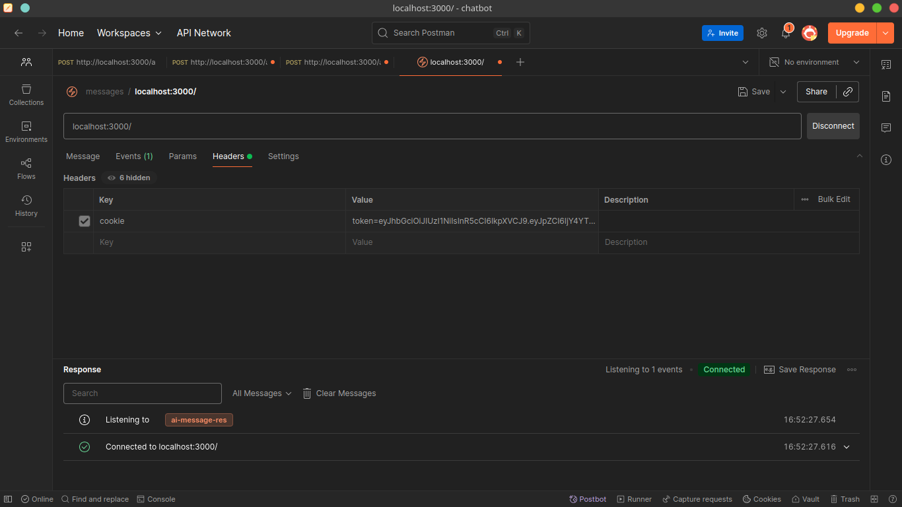

# NEW: Authentication in  Socket.IO

```js
  const cookie=require('cookie');
  const jwt= require("jsonwebtoken");
  const userModel = require("../models/user.model");


  io.use(async (socket, next) => {
    // Parse cookies from the incoming request headers
    const cookies = cookie.parse(socket.handshake.headers.cookie || "");

    // If there's no `token` in cookies, reject the connection
    if (!cookies.token) {
      return next(new Error("No Token"));
    }

    try {
      // Verify the JWT token using your secret
      const decoded = jwt.verify(cookies.token, process.env.JWT_SECRET);

      // Find the user in the database (based on id from token)
      const user = await userModel.findById(decoded.id);

      // Attach user info to the socket object for later use
      socket.user = user;

      // Allow the connection to proceed
      next();
    } catch (error) {
      // If token is invalid or verification fails
      next(new Error("Invalid Token"));
    }
  });
```
# How to send cookie or token

**If you want to share cookies with a WebSocket (or socket.io) connection, you can’t rely on them being automatically sent after the upgrade. Instead, you handle it in the handshake request headers.**
```js
headers: {
    Cookie: "sessionId=abc123;" // manually attach cookie
  }
```



## 🔑 What’s happening here:

### Handshake phase

- When a client tries to connect to your Socket.IO server, it first sends an HTTP handshake request.

- This request contains headers, including cookies (if any).

**Extracting the JWT**

- cookie.parse(...) extracts cookies from the headers.

- The middleware checks if a token cookie exists.

**Token verification**

- jwt.verify(...) checks if the token is valid and not expired, using the secret you signed it with.

- If valid, it returns the decoded payload (which usually has the user ID).

**Fetching the user**

- The user ID (decoded.id) is used to fetch the full user from your database.

- That user object is then attached to socket.user.

**Grant or deny connection**

- If everything is valid, next() is called → connection succeeds.

- If not, next(new Error(...)) → the connection fails and the client gets an error.